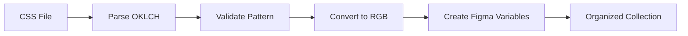

# Tailwind OKLCH to Figma Variables

> **Automatically convert Tailwind CSS color variables using OKLCH color space into properly organized Figma color variables with accurate RGB conversion.**

[](https://figma.com) [](https://developer.mozilla.org/en-US/docs/Web/CSS/color_value/oklch) [](https://tailwindcss.com)

## Why This Plugin?

Modern CSS uses OKLCH for better color manipulation, but Figma only understands RGB/hex. This plugin bridges that gap by automatically converting your Tailwind OKLCH variables into organized Figma design variables.

**Before:** Manual conversion of dozens of color variables  
**After:** One-click import with perfect color accuracy

## Quick Start

1. **Prepare your CSS** with Tailwind OKLCH variables:

   ```css
   --color-red-25: oklch(0.986 0.007 17.38);
   --color-blue-500: oklch(0.627 0.258 29.23);
   --color-purple-800: oklch(0.345 0.189 302.71 / 0.9);
   ```

2. **Run the plugin** in Figma
3. **Select** a variable collection (or create new)
4. **Upload** your CSS file
5. **Review** the preview and apply changes

## ✨ Features

- 🎯 **Accurate Color Conversion** - OKLCH → RGB with industry-standard algorithms
- 📁 **Smart Organization** - Automatic color family grouping (`color/red/25`, `color/blue/500`)
- ⚡ **Batch Processing** - Handle hundreds of variables at once
- 🔄 **Update Detection** - Shows what's new vs. existing
- ✅ **Format Validation** - Clear error messages for invalid patterns
- 🎨 **Alpha Support** - Handles transparency in OKLCH colors

## Supported Formats

### Variable Naming Pattern

```css
--color-{name}-{number}: oklch(...);
```

**✅ Valid Examples:**

- `--color-red-25` → `color/red/25`
- `--color-emerald-500` → `color/emerald/500`
- `--color-slate-950` → `color/slate/950`

**❌ Invalid Examples:**

- `--primary-color` (doesn't match pattern)
- `--color-neutral-dark-500` (extra segment)

### OKLCH Color Formats

```css
/* Basic OKLCH */
oklch(0.627 0.258 29.23)

/* With Alpha Channel */
oklch(0.345 0.189 302.71 / 0.9)
oklch(0.627 0.258 29.23 / 85%)
```

## How It Works



The plugin uses a precise color conversion pipeline:

1. **OKLCH → OKLab** (polar to cartesian)
2. **OKLab → Linear RGB** (standard matrix conversion)
3. **Linear RGB → sRGB** (gamma correction)
4. **sRGB → Hex** (for Figma compatibility)

## Example Conversion

**Input CSS:**

```css
--color-red-25: oklch(0.986 0.007 17.38);
--color-red-500: oklch(0.627 0.258 29.23);
--color-red-900: oklch(0.345 0.189 302.71);
```

**Output in Figma:**

```
📁 color/red/
  ├── 25  (#FEF7F7)
  ├── 500 (#0066CC)
  └── 900 (#6B21A8)
```

## Error Handling

The plugin provides clear feedback for common issues:

| Error Type         | Example              | Solution                         |
| ------------------ | -------------------- | -------------------------------- |
| Invalid Pattern    | `--primary-color`    | Use `--color-name-number` format |
| Malformed OKLCH    | `oklch(invalid)`     | Check OKLCH syntax               |
| Out of Range       | `oklch(2.0 0.5 180)` | Lightness must be 0-1            |
| Missing Collection | -                    | Select or create a collection    |

## File Structure

```
├── manifest.json     # Plugin configuration
├── code.js          # Core conversion logic
├── ui.html          # User interface
└── README.md        # Documentation
```

## Technical Notes

**Figma Plugin Environment Limitations:**

- Uses ES5-compatible JavaScript only
- No modern ES6+ features (template literals, arrow functions, etc.)
- Custom OKLCH conversion algorithm (no external libraries)

**Browser Compatibility:**

- Figma Desktop and Web applications
- No external dependencies required

## Contributing

Found a bug or want to contribute? This plugin follows Figma's plugin development constraints, so all JavaScript must be ES5-compatible.

## License

[Add your license here]

---

**Made for designers who want to bridge the gap between modern CSS and Figma design systems.**
